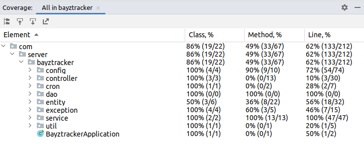

# BayzTracker - August 5th 2022

## Components
 
- Login
  - This module handles the authentication of User. We are using JWT Role Based login to identify normal user and admin.
  - Token generated has 1 day of validity as this is just testing project. It can be changed to 60min in future based on requirement.
  - I have Whitelisted `/auth/*` so that users can log in.
    
- Currency
  - This module has authorized CRUD end-point related to Currency.
  - `name` will be used as primary key for this particular table.
  - Only `admin` will be allowed to create new Currency.
  - I have added `enabled` field to check active status of Currency. This will be used for Soft-Deletion of any Currency.
  - I will only perform soft-delete by changing `enabled` to `false` so that we will have history of listed Currency.
  - Currency Scheme is as follows:  

| Field        | Type         | Key         |
|--------------|--------------|-------------|
| name         | varchar(255) | Primary key |
| active       | bit(1)       |             |
| created_time | varchar(255) |             |
| enabled      | bit(1)       |             |
| symbol       | varchar(255) | Unique      | 

- Alert
  - This module authorized CRUD end-point for creating Alerts.
  - We will be using `Currency.symbol` i.e. `Currency.symbol == Alert.currency` to create alerts as they are unique for every currency.
  - Only `user` is allowed to create an alert for active Currency.
  - I have added `created_by` field to track who has created the alert and send notification to that person.
  - Alert schema is as follows:  

| Field        | Type         | Key         | Extra          |
|--------------|--------------|-------------|----------------|
| id           | int          | Primary key | auto increment |
| created_at   | varchar(255) |             |                |
| created_by   | varchar(255) |             |                |
| currency     | varchar(255) |             |                |
| status       | varchar(255) |             |                |
| target_price | float        |             |                |

- Scheduler
  - Alert scheduler will run every 30sec and log the price reached message. Then Mobile team will have to call `/acknowledge` to ACKED the alert.  
  
- Unit Test
  - I have added Unit test for service layer with minimum 60% overall coverage and service layer 100% coverage.

  
- Exception
  - I created a global exception handler with name `GlobalExceptionHandler` to print proper reason of exception/error.  

- Postman Collection
  - I have created Postman Collection for Bayztracker with name `Bayztracker.postman_collection.json` and added it to root of project.
  - Postman collection can also be imported using URL = ( https://www.getpostman.com/collections/f4e833683043757870eb ).
  
  
- Dockerfile
  - Please run below commands to run to create Docker image and test it using Docker
  - docker network create <network-name> [ ex: bayzat-assignment ]
  - docker run --name mysqldb --network bayzat-assignment -e MYSQL_ROOT_PASSWORD=password -e MYSQL_DATABASE=bayzat -d mysql:8
  - mvn install
  - docker image build -t <image-name> [ex: bayzat] .
  - docker run --network bayzat-assignment --name bayztracker-assignment -p 8080:8080 -d bayzat
  - Note: Update application.properties according as per comment in that file.
